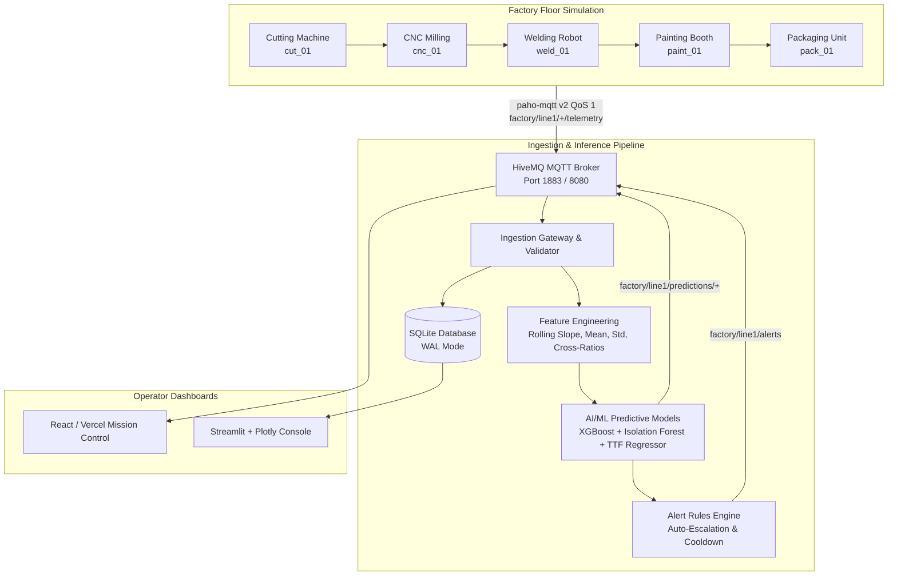

# Smart Production-Line Downtime Prediction

A cyber-physical IoT & Machine Learning platform that simulates an industrial 5-station manufacturing line, streams real-time sensor telemetry over MQTT via HiveMQ, ingests records into SQLite WAL storage, computes rolling temporal features, forecasts equipment downtime before physical breakdown using XGBoost and Isolation Forests, issues multi-tier alerts, and renders a live mission-control dashboard.



---

## 1. Quick Start Guide

### Step 1: Install Dependencies
```bash
pip install -r requirements.txt
# or
make install
```

### Step 2: Start HiveMQ MQTT Broker
```bash
make broker
# or: docker compose up -d hivemq
# Access HiveMQ Control Center at http://localhost:8080
```

### Step 3: Seed 30-Day Historical Data (< 2 minutes)
```bash
make seed-data
```

### Step 4: Train AI / ML Models
```bash
make train
```

### Step 5: Start Live Ingestion, ML Inference & Dashboard
```bash
make all
```

---

## 2. Testing the Section 13 Benchmark Demonstration

To verify that the system flags machine failure before failure happens:
```bash
# Inject progressive bearing wear on CNC Milling:
python3 src/simulator/cli.py --inject-fault --machine cnc_01 --type bearing_wear

# Result:
# 1. Spindle vibration and thermal gradient begin climbing.
# 2. XGBoost failure probability climbs past 0.60, triggering a WARNING alert ~28 minutes before failure.
# 3. Time-to-failure countdown indicates remaining safe operation.
# 4. Operator receives mitigation recommendations before mechanical fault status.
```

---

## 3. Web Dashboard (Vercel Ready)
This project includes a React 19 + TypeScript + Tailwind v4 web dashboard deployable directly to Vercel or running locally via:
```bash
npm run dev
# Open http://localhost:3000
```
To deploy to Vercel:
```bash
npm run build
vercel deploy --prod
```
